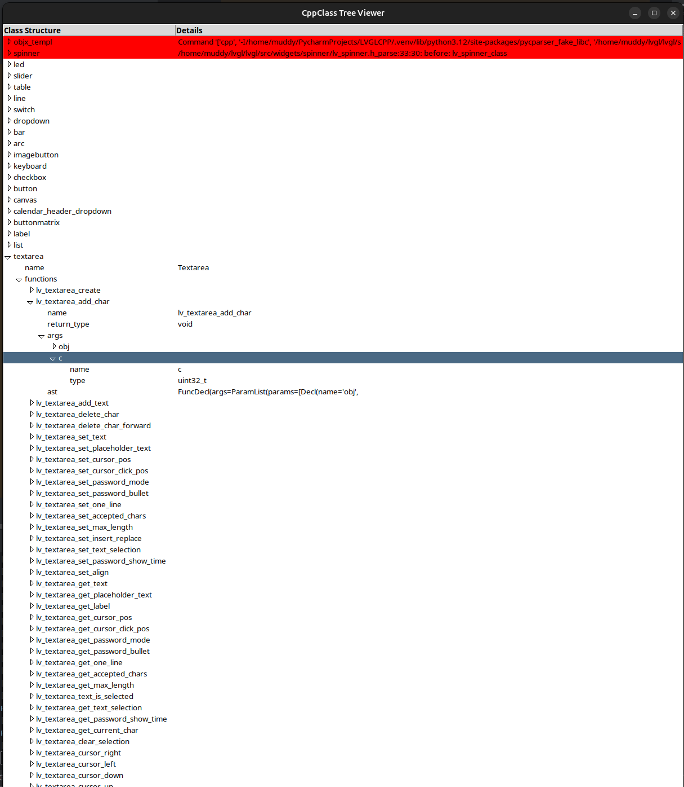

# LVGL_CPP
Automatic CPP binding generator for LVGL


## Tools
- Python3
- - pycparser
- - tkinter for treeview to crosscheck parsing and view problematic files (not necesary)

## Preliminaries
Some assumptions are made on the LVGL base source code that we are using
to create a auto-generated CPP-binding for LVGL

In LVGL we can see a typical pattern in file names and general structure of the LVGL project,
such as function names, "classes" and their corresponding functionality.
This is the main entry point for automatic generation and is described below:
### _TODO_: Implement LVGL API-biding coding style
We will in the future try to fully connect these Preliminaries in accordance to the LVGL api-binding Coding style
Goal is to fully implement the Coding Style as the foundation mechanism for generation.


### Classes
Classes are generated in the following manner:
- A file lv_{CLASSNAME}.h exists
### Functions
- all non-static member functions are written in the following way:
lv_{CLASSNAME}_{FUNCTIONAME}(lv_{BASENAME|CLASSNAME}_t *, ...)
- static class functions are written like this:
lv_{CLASSNAME}_{FUNCTIONAME}(...), where the first parameter is different to:
lv_{BASENAME|CLASSNAME}_t

### Inheritance
{BASECLASS} is a parent/base of {CLASSNAME} if:
a function lv_create_{CLASSNAME} exists in lv_{CLASSNAME}.h and has a pointer-return type that is not:
{CLASSNAME} *, then the return type {BASECLASS} * is used to determine the base class.


# Current Status
The current state is a rough draft that shows a demonstration of how the automatic generation can work
to generically generate the hpp wrapper classes. You sould see it as a test-case to just showcase the possibility to use the pycparser generated ast tree and use to extract coding logic to generate hpp files with containing logic automatically.
It also shows, that it is in general possible to include logic from the API-binding Coding Style directly into the parser, have a look at:
```python3
# Determine if this is a standalone class
standalone = False
for func in functions:
    #tqdm.write(f"[{class_name} | Function:] {func}")
    if func["name"] == f"lv_{lowercase_classname}_create":
        # Check if the first parameter is `lv_obj_t * parent`
        params = func["args"]
        tqdm.write(f"[Write: FunctionParams]{params[0]}")
        first_arg = params[0]
        tqdm.write(f"[Write: FunctionParams]{params[0]} | FirstArg:{first_arg["type"], first_arg["name"]}")
        if not params or not str.startswith(first_arg["type"],"lv_obj_t*"):
            standalone = True
        break
```
Here we are implementing the logic for the create syntax for objects.
And it is also possible to parse that into an object-oriented cpp class:
```python3

    # Adjust class definition based on standalone or base class
    if standalone:
        constructor = f"""
    explicit {class_name}() {{
        setRoot(std::shared_ptr<lv_obj_t>(
            lv_{lowercase_classname}_create(),
            [](lv_obj_t* obj) {{ lv_obj_del(obj); }}
        ));
    }}
"""
        base_class_declaration = ""
    else:
        constructor = f"""
    explicit {class_name}({base_class}& parent)
        : {base_class}() {{
        setRoot(std::shared_ptr<lv_obj_t>(
            lv_{lowercase_classname}_create(parent.getRoot().get()),
            [](lv_obj_t* obj) {{ lv_obj_del(obj); }}
        ));
    }}
"""
```

This leads to the hpp-code:
```cpp
// Arc class, auto-generated
class Arc : public BaseClass {
public:

    explicit Arc(BaseClass& parent)
        : BaseClass() {
        setRoot(std::shared_ptr<lv_obj_t>(
            lv_arc_create(parent.getRoot().get()),
            [](lv_obj_t* obj) { lv_obj_del(obj); }
        ));
    }


    ~Arc() = default;
```
of course, the logic is still not correct - (e.g. BaseClass type is not yet correctly determined as Object)
also lv_obj_t is hard-coded and should be autimatically mapped to it's cpp classes member function.

Furthermore for all lv_[...].h files Classes can be created and also the member-function calls are already generated,
anyways they are still referencing the c-api. But just a showcase for one of the dynamically generated classes:
```cpp
#ifndef ARC_HPP
#define ARC_HPP

#include "BaseClass.hpp"

// Arc class, auto-generated
class Arc : public BaseClass {
public:

    explicit Arc(BaseClass& parent)
        : BaseClass() {
        setRoot(std::shared_ptr<lv_obj_t>(
            lv_arc_create(parent.getRoot().get()),
            [](lv_obj_t* obj) { lv_obj_del(obj); }
        ));
    }


    ~Arc() = default;


    lv_obj_t* create(lv_obj_t* parent) {
        return lv_arc_create(getRoot().get(), parent);
    }


    void set_start_angle(lv_obj_t* obj, lv_value_precise_t start) {
        return lv_arc_set_start_angle(getRoot().get(), obj, start);
    }


    void set_end_angle(lv_obj_t* obj, lv_value_precise_t end) {
        return lv_arc_set_end_angle(getRoot().get(), obj, end);
    }


    void set_angles(lv_obj_t* obj, lv_value_precise_t start, lv_value_precise_t end) {
        return lv_arc_set_angles(getRoot().get(), obj, start, end);
    }


    void set_bg_start_angle(lv_obj_t* obj, lv_value_precise_t start) {
        return lv_arc_set_bg_start_angle(getRoot().get(), obj, start);
    }


    void set_bg_end_angle(lv_obj_t* obj, lv_value_precise_t end) {
        return lv_arc_set_bg_end_angle(getRoot().get(), obj, end);
    }


    void set_bg_angles(lv_obj_t* obj, lv_value_precise_t start, lv_value_precise_t end) {
        return lv_arc_set_bg_angles(getRoot().get(), obj, start, end);
    }


    void set_rotation(lv_obj_t* obj, int32_t rotation) {
        return lv_arc_set_rotation(getRoot().get(), obj, rotation);
    }


    void set_mode(lv_obj_t* obj, lv_arc_mode_t type) {
        return lv_arc_set_mode(getRoot().get(), obj, type);
    }


    void set_value(lv_obj_t* obj, int32_t value) {
        return lv_arc_set_value(getRoot().get(), obj, value);
    }


    void set_range(lv_obj_t* obj, int32_t min, int32_t max) {
        return lv_arc_set_range(getRoot().get(), obj, min, max);
    }


    void set_change_rate(lv_obj_t* obj, uint32_t rate) {
        return lv_arc_set_change_rate(getRoot().get(), obj, rate);
    }


    void set_knob_offset(lv_obj_t* obj, int32_t offset) {
        return lv_arc_set_knob_offset(getRoot().get(), obj, offset);
    }


    lv_value_precise_t get_angle_start(lv_obj_t* obj) {
        return lv_arc_get_angle_start(getRoot().get(), obj);
    }


    lv_value_precise_t get_angle_end(lv_obj_t* obj) {
        return lv_arc_get_angle_end(getRoot().get(), obj);
    }


    lv_value_precise_t get_bg_angle_start(lv_obj_t* obj) {
        return lv_arc_get_bg_angle_start(getRoot().get(), obj);
    }


    lv_value_precise_t get_bg_angle_end(lv_obj_t* obj) {
        return lv_arc_get_bg_angle_end(getRoot().get(), obj);
    }


    int32_t get_value(lv_obj_t* obj) {
        return lv_arc_get_value(getRoot().get(), obj);
    }


    int32_t get_min_value(lv_obj_t* obj) {
        return lv_arc_get_min_value(getRoot().get(), obj);
    }


    int32_t get_max_value(lv_obj_t* obj) {
        return lv_arc_get_max_value(getRoot().get(), obj);
    }


    lv_arc_mode_t get_mode(lv_obj_t* obj) {
        return lv_arc_get_mode(getRoot().get(), obj);
    }


    int32_t get_rotation(lv_obj_t* obj) {
        return lv_arc_get_rotation(getRoot().get(), obj);
    }


    int32_t get_knob_offset(lv_obj_t* obj) {
        return lv_arc_get_knob_offset(getRoot().get(), obj);
    }


    void align_obj_to_angle(lv_obj_t* obj, lv_obj_t* obj_to_align, int32_t r_offset) {
        return lv_arc_align_obj_to_angle(getRoot().get(), obj, obj_to_align, r_offset);
    }


    void rotate_obj_to_angle(lv_obj_t* obj, lv_obj_t* obj_to_rotate, int32_t r_offset) {
        return lv_arc_rotate_obj_to_angle(getRoot().get(), obj, obj_to_rotate, r_offset);
    }


};

#endif // ARC_HPP
```

there is also a GUI in TK that shows the parsing status:



## Outlook and TODOs
The current state is not really ready to go. It's a showcase that clearly demonstrates that this concept works.
- split project into python classes
- build a real parse-logic that gives an easy interface to integrate the api condind style.
- make a real write-logic class that fully maps the ast elements to a logically correct cpp class
- class genertaion mechnisms should provide interfaces and are abstracted into various classes, such as
- - Fomatting and style interfaces (functions, classes, etc | CamelCase, UpperCase, SnakeCase,...)
- - Class lookup logic (map everything possible from c to auto-generated cpp implementation)
- - c->cpp logic based on api conding style (write logic connected to parse logic)
- - - correctly generate type_traits and templates for compile-time (constants), to provide the real power of cpp
- - ...
- auto-parse examples from c-code and generate cpp examples
- documentation-integration
- installation guide
- wiki, todos, ...
- contribution guide
- ...